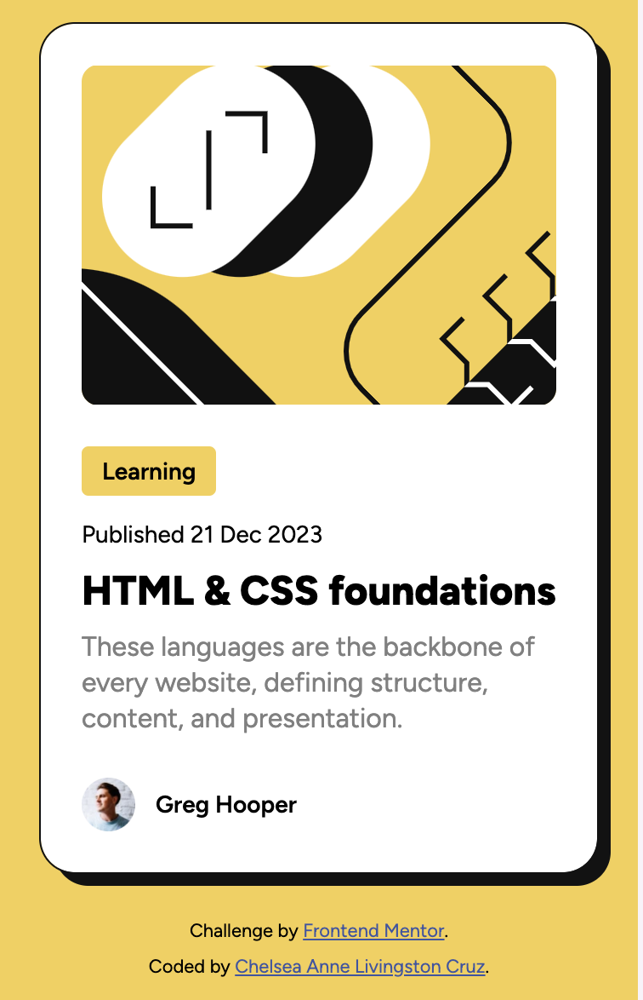

# Frontend Mentor - Blog preview card solution

This is a solution to the [Blog preview card challenge on Frontend Mentor](https://www.frontendmentor.io/challenges/blog-preview-card-ckPaj01IcS). Frontend Mentor challenges help you improve your coding skills by building realistic projects.

## Table of contents

- [Overview](#overview)
  - [The challenge](#the-challenge)
  - [Screenshot](#screenshot)
  - [Links](#links)
- [My process](#my-process)
  - [Built with](#built-with)
  - [What I learned](#what-i-learned)
  - [Useful resources](#useful-resources)
- [Author](#author)
- [Acknowledgments](#acknowledgments)

## Overview

### The challenge

Users should be able to:

- See hover and focus states for all interactive elements on the page

### Screenshot



### Links

- Solution URL: [https://github.com/chelsea-here/blogPreviewCard](https://github.com/chelsea-here/blogPreviewCard)
- Live Site URL: [https://blog-preview-card-eight-alpha.vercel.app](https://blog-preview-card-eight-alpha.vercel.app)

## My process

### Built with

- Semantic HTML5 markup
- CSS custom properties
- Flexbox
- CSS Grid

### What I learned

I decided to go back to the fundamentals for this project using vanilla html/css/js. It's helpful as I learn to remember the basics.

Trying to associate font size with viewport dimensions instead of rem gets a bit complicated. CSS has recently developed (and browsers have largely adopted) Container Queries which can be used to create highly fluid typography. I did not end up persuing this method, as it was above and beyond what was required for the task. I used clamp which worked for my purposes, but I was glad to learn of the above.

I was able to modify text color using css but wanted to challenge myself using javascript. See below for a piece of code I'm particularly proud of.

```css
h1 {
  font-size: clamp(1rem, 5.333333vw, 1.5rem);
}
```

```js
// accessing the color variables from my css file
const style = getComputedStyle(document.body);
const yellow = style.getPropertyValue("--primary-color-yellow");
// creating mouseover effect
title.addEventListener("mouseover", function (e) {
  this.style.color = yellow;
});

// now i need a mouseout event listener so its only active during my hover
title.addEventListener("mouseout", function (e) {
  this.style.color = "";
});
```

### Useful resources

- [Modern CSS](https://moderncss.dev/container-query-units-and-fluid-typography/) - In depth article on how to use container queries to create fluid typography.
- [MDN re: container queries](https://developer.mozilla.org/en-US/docs/Web/CSS/CSS_containment/Container_queries)

## Author

- Website - [My Github](https://github.com/chelsea-here)
- Frontend Mentor - [@chelsea-here](https://www.frontendmentor.io/profile/chelsea-here)

## Acknowledgments

Thank you too all those who have taken their time to provide free resources. Special thanks to contributors at freecodecamp.org for helping me get started!

# blogPreviewCard
